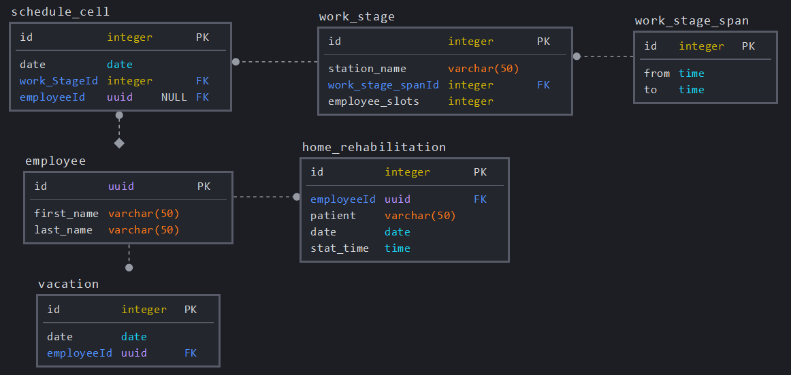

<h1 align="center">Medic Schedule Manager - server</h1>

&nbsp;

&nbsp;

&nbsp;

&nbsp;

&nbsp;

&nbsp;

> 
 Technology stack used to build Medic Schedule Manager application. 

&nbsp;

## Table of Contents

- [Overview](#overview)
- [Databse](#databse)
- [Authentication](#authentication)
- [Deployment](#deployment)

## Overview

This repository contains backend code for web application [Fizjo-Medyk](https://fizjo-medyk.swidnica.pl). Visit [this repository](https://github.com/Cararr/medic_schedule_manager_client) for more information about the app. The server runs on **Node.js** engine, supplemented with **Express** framework. 100% of application was written with **Typescript** and then compiled to JS. Source file structure consists of 3 layers:

1. Application: Routers and their controllers & middleware. REST API responsible for handling http traffic.
2. Domain: Database's models.
3. Infrastructure: Schedule Generator's logic and app's logger.

## Databse

- DBMS: PostgreSQL
- ORM: [TypeORM](https://typeorm.io/#/)
- Schema: 

## Authentication

Server utilize JWT system for user authorization. Tokens are stored inside `token` cookie with 24 hours expiration time.

## Deployment

Application is running on [Amazon EC2](https://aws.amazon.com/ec2/?ec2-whats-new.sort-by=item.additionalFields.postDateTime&ec2-whats-new.sort-order=desc) Linux instance (Ubuntu 20.04). SSL certificate is provided by Let's Encrypt.

---

> _Visit my [Github](https://github.com/Cararr) account for more or contact me at cararr@tlen.pl!_
